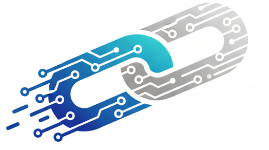

<div align="center">
  
  <h1>ZENER</h1>
  <p><strong>Digital Supply Chain Solutions &amp; Operational Infrastructure</strong></p>
  <p><em>A Zener Holdings Company</em></p>
</div>

---

## 🌐 Zener Holdings Ecosystem

**Zener Holdings** is the parent conglomerate orchestrating unified digital supply chains, global commodity networks, financial intelligence, and modern consumer commerce.

| Entity | Industry / Focus | Platform | Status |
| :--- | :--- | :--- | :--- |
| **ZENER** | Digital SCM &amp; ERP Infrastructure (SAP, Oracle, Dynamics) | *Flagship System (This Repo)* | `Active Core` |
| **Spice Chain** | Global Operating System for Spices &amp; Agri Commodities | [spicechain.vercel.app](https://spicechain.vercel.app/) | `Live Node` |
| **Mahwar (محور)** | GCC Financial &amp; SCM Intelligence Terminal (48 Engines, DCF, LBO) | [mahwar.vercel.app](https://mahwar.vercel.app/) | `Live Terminal` |
| **Street Slipp** | Next-Gen Streetwear, Lifestyle &amp; Direct-to-Consumer Commerce | [streetslipp.store](https://streetslipp.store/) | `Live Store` |

---

## ⚡ Core Capabilities

- **ERP Integration:** Connects legacy ERPs (SAP S/4HANA, Oracle NetSuite, Microsoft Dynamics) into a unified operational backbone.
- **BI &amp; Telemetry:** Real-time visibility, automated inventory planning, and demand forecasting.
- **Control Center:** Mission-control dashboard displaying live system status, active nodes, throughput, and cross-platform synchronization.
- **Conglomerate Mesh:** Synchronized connectivity across all sister groups under Zener Holdings.

---

## 🚀 Quick Start

### Prerequisites
- Node.js (v18+)
- npm or yarn

### 1. Installation
```bash
npm install
```

### 2. Development Server
```bash
npm run dev
```

### 3. Production Build
```bash
npm run build
```

---

## 🛡️ License &amp; Copyright

&copy; 2026 **Zener Holdings Ltd.** All rights reserved. SCM &amp; Infrastructure Division.
